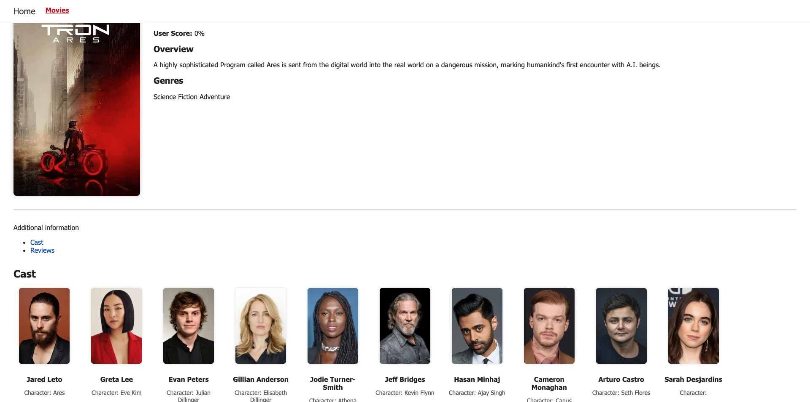

# 🎬 Movie Search App 

A movie search application built with **React**, **Vite**, **React Router**, and **TMDB API**.  
The app allows users to explore trending movies, search by keyword, and view detailed information including cast and reviews.  

---
## 📸 Preview



---

## 🚀 Demo
- **Live Demo (Vercel):** [Movie Search App](https://movie-search-app-amber-five.vercel.app/)  
- **GitHub Repository:** [Source Code](https://github.com/zekirovskii/movie-search-app)

---

## 📦 Features
- 🔎 Browse today’s trending movies (HomePage)  
- 🎥 Search for movies by keyword (MoviesPage)  
- 📄 View detailed information for each movie (MovieDetailsPage)  
- 👥 Check the cast of a movie (MovieCast)  
- 📝 Read reviews for a movie (MovieReviews)  
- ⛔ Navigate to a NotFoundPage for invalid routes  
- 🧭 Smooth navigation with React Router (NavLink, useLocation, useParams, useSearchParams)  
- ⏳ Loading and ⚠️ Error states for each request  
- 📦 Asynchronous code splitting with **React.lazy** and **Suspense**  
- 🎨 Styled with **CSS Modules**  

---

## 🛠️ Tech Stack
- [React 18](https://react.dev/) + [Vite](https://vitejs.dev/)  
- [React Router v6](https://reactrouter.com/)  
- [Axios](https://axios-http.com/)  
- [TMDB API](https://developer.themoviedb.org/docs)  
- [CSS Modules](https://github.com/css-modules/css-modules)  

---
```
## 📂 Project Structure
goit-react-hw-05-movie-search/
│── public/
│
│── src/
│ ├── components/
│ │ ├── App/
│ │ │ ├── App.jsx
│ │ │ └── App.module.css
│ │ ├── Navigation/
│ │ │ ├── Navigation.jsx
│ │ │ └── Navigation.module.css
│ │ ├── MovieList/
│ │ │ ├── MovieList.jsx
│ │ │ └── MovieList.module.css
│ │ ├── MovieCast/
│ │ │ ├── MovieCast.jsx
│ │ │ └── MovieCast.module.css
│ │ ├── MovieReviews/
│ │ │ ├── MovieReviews.jsx
│ │ │ └── MovieReviews.module.css
│ │
│ ├── pages/
│ │ ├── HomePage/
│ │ │ ├── HomePage.jsx
│ │ │ └── HomePage.module.css
│ │ ├── MoviesPage/
│ │ │ ├── MoviesPage.jsx
│ │ │ └── MoviesPage.module.css
│ │ ├── MovieDetailsPage/
│ │ │ ├── MovieDetailsPage.jsx
│ │ │ └── MovieDetailsPage.module.css
│ │ └── NotFoundPage/
│ │ ├── NotFoundPage.jsx
│ │ └── NotFoundPage.module.css
│ │
│ ├── services/
│ │ └── tmdbApi.js
│ │
│ ├── main.jsx
│ └── index.css
│
│── package.json
```
---

## ⚙️ Installation & Setup
```bash
# Clone the repository
git clone https://github.com/username/goit-react-hw-05-movie-search.git

# Navigate into the project folder
cd goit-react-hw-05-movie-search

# Install dependencies
npm install

# Run the development server
npm run dev
🔑 API Configuration
Create a free account at TMDB.
Get your API Read Access Token from the developer dashboard.
Create a .env file in the project root:
VITE_TMDB_TOKEN=your_api_read_access_token
All requests will use this token in the Authorization header.
